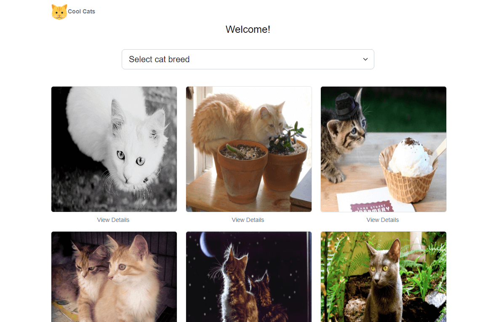

# Cools Cats

A full-stack app that displays cat photos using [TheCatsAPI](https://docs.thecatapi.com/).
See the [demo here](https://cool-cats-2023.netlify.app/)

## Libraries used

- React-router-dom
- React-bootstrap / Bootstrap
- Axios
- Context API (for state management)
- Styled-components
- Typescript (recommended)
- Eslint

## Local setup

See instructions in ReadMe of client and server directories
